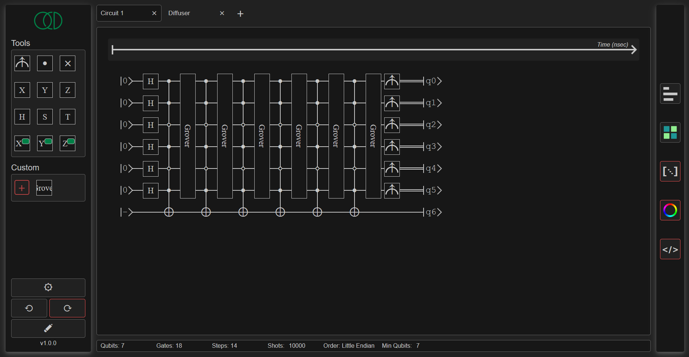
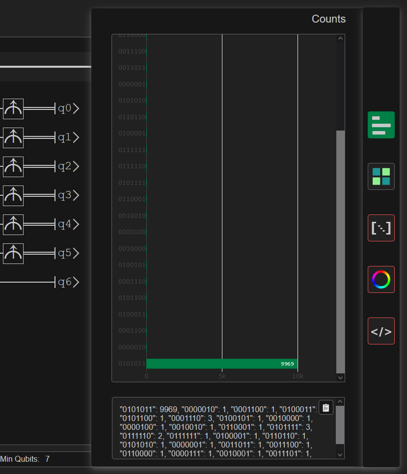

# <div style="text-align: center;">QuaCiDe</div>

<div style="text-align: center;">
    

QuaCiDe (pronounced *cassidy*) is an intuitive, user-friendly quantum circuit designer made in HTML/TS/CSS/Python. Its simplistic design but powerful foundation aims to enable learning in the field of Quantum Computing and ease research and experimentation by liberating the user from technical demands, such as program installations, coding, scaling restrictions etc.
</div>

## Local Installation
The present product is still in Alpha development phase, therefore to access it you'll have to run its files in a controlled IDE environment that offers and/or supports servers for HTML execution. [Visual Studio Code](https://code.visualstudio.com/) running Node.js and Live Server is recommended. 

You can install this package directly from the terminal:
```
npm install asimakiskydros/QuaCiDe
```

Both [`interface.html`](./interface.html) and [`qiskit-qasm.py`](./parsers/qiskit-qasm.py) need to be running for the designer to be fully functional. Make sure Python 3, Node.js and all listed languages are supported by your system.

The first time you install and every time you make a change in the TypeScript code, run the following so your changes take effect:
```
npm run build
```

## Usage
<div>
    
</div>

The UI offers a variety of user-friendly actions:
* All the mainstream one- and two-qubit gates are offered by default, along with measurements and controls, to be dragged and dropped on any qubit.
* `SHIFT+click` on a gate to spawn a copy next to it. `CTRL+click` on it to spawn a copy below it. `Right-click` it to delete it instantly.
* Shove gates between other placed gates to spawn new steps on command.
* New qubits spawn at the bottom of the register each time a gate is picked up.
* A set amount of initial qubits can also be spawned on demand by setting the `Min Qubits` variable on the toolbar.
* Redundant qubits and steps are detected and deleted automatically.
* Qubits are interactable threefold: `Click` their state display to shuffle between the Bloch sphere edges `|0⟩, |1⟩, |+⟩, |-⟩, |+i⟩, |-i⟩`; `CTRL+click` it to shuffle between color-coded registers. Neihboring registers with the same color get unified into one; `Double-click` on their name display to give it a different alias. Press `SHIFT` while doing any of the above to reset to the default value.
* `Undo` and `Redo` actions on each circuit through the relevant toolbox buttons, or by pressing `CTRL+Z` and `CTRL+Y` respectively.
* `Clear` everything on the current circuit through the relevant toolbox button or by pressing `CTRL+C`.
* See the resources and the specifications of each circuit on the toolbar: `#Qubits`, `#Gates` and `#Steps` are updated on every change; `#Shots`, `Endian Order` and `Min Qubits` are set by the user.
* Create and moderate multiple circuits at a time by spawning new `Tabs`. This can also be done by invoking `CTRL+Q`.
* Turn valid circuits into custom gates through the relevant toolbox button or by pressing `CTRL+A`.
* Customize the designer to your liking by changing the global `Settings`.

## Outputs
Execute the current circuit instance to get the output you desire: currently, two output kinds are offered: `counts` and `statevector`, with three more underway. All outputs can be found on the right-hand sidebar. Execution currently uses [`Qiskit`](https://github.com/Qiskit/qiskit) and [`Qiskit-Aer`](https://github.com/Qiskit/qiskit-aer) to run the experiment, with more options to come.

<div style="display: grid; place-items: center">
    
</div>

Outputs are displayed as text but also as interactable charts. Text can be copied directly and charts are readily downloadable as PNGs.

## About
This project started as my [Bachelor's Thesis](https://drive.google.com/file/d/11WY6MKDfsAy17eLjut5jI86e88H3RzIr/view?usp=sharing), but quickly grew beyond that scope. While still being in Alpha stage and thus, not ready for F/OSS distribution, it is meant to become completely open to everyone in the near future. In the meantime, any suggestions are very welcome.
